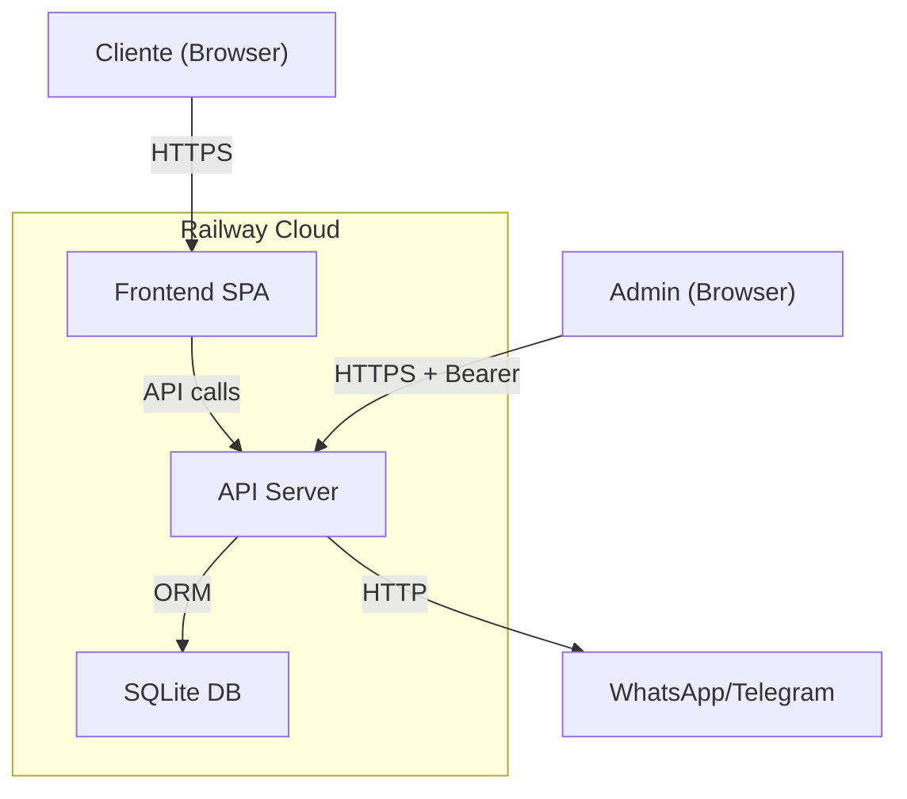

# Threat Model — Mão na Massa Delivery

> **Gerado em:** 27/06/2026  
> **Skill:** security-threat-model v1.0.0  
> **Contexto validado com o usuário:** Sim (deployment Railway, dados: nome/WhatsApp, admin single-user)

---

## Executive Summary

O Mão na Massa é um sistema de gestão de produção e vendas de salgados/doces com dois perfis: admin (gestão completa) e cliente (tracking público). Implantado no Railway com exposição à internet. O principal risco é **exfiltração do token de admin** (armazenado em localStorage) ou **abuso do endpoint público de criação de pedidos** (sem autenticação). Dados sensíveis são mínimos (nome/WhatsApp), reduzindo o impacto de vazamentos. O sistema já conta com autenticação Bearer para rotas admin, rate limiting no login e CSP básico.

---

## Scope and Assumptions

### In-scope
- Caminho: `/` (raiz do repositório)
- Componentes runtime: backend FastAPI, frontend React, banco SQLite
- Toda a stack: API, frontend SPA, PWA/service worker

### Out-of-scope
- CI/CD pipelines (Railway deploy)
- Dependências de terceiros (bibliotecas npm/PyPI)
- Infraestrutura de rede (Railway edge, DNS, SSL)

### Assumptions
1. **Deployment**: Railway (cloud público), acessível via internet sem WAF/VPN
2. **Admin auth**: Token fixo via `ADMIN_TOKEN` env var, armazenado em localStorage no frontend
3. **Dados**: Apenas nome e WhatsApp dos clientes — sem CPF, endereço ou dados de pagamento completos
4. **Usuários**: 1 admin (casal) + clientes finais (tracking público)
5. **Banco**: SQLite (single-file, sem replicação) — risco de corrupção em caso de falha
6. **Rate limiting**: Apenas no `/admin/login` (10/min) — demais endpoints sem rate limit

### Open Questions
- Haverá backup do banco SQLite? (afeta risco de perda de dados)
- O Railway fornece SSL automático? (afeta classificação de risco para tráfego HTTP)

---

## System Model

### Primary Components

| Component | Tech | Description |
|-----------|------|-------------|
| **Frontend SPA** | React 19 + Vite | Interface admin + landing page + tracking |
| **API Server** | FastAPI + Uvicorn | Todos os endpoints REST |
| **SQLite DB** | aiosqlite/SQLAlchemy | Dados de pedidos, ingredientes, configs |
| **Service Worker** | Workbox (PWA) | Cache offline, instalação |
| **WhatsApp/Telegram** | wa.me links + Telegram Bot | Notificações de pedidos |
| **Evolution API** | Self-hosted (opcional) | WebSocket WhatsApp |

### Data Flows and Trust Boundaries

1. **Internet → Frontend SPA**
   - Dados: HTML/JS/CSS estáticos, requisições API
   - Canal: HTTPS (via Railway edge)
   - Garantias: CSP básico, X-Content-Type-Options, X-Frame-Options

2. **Frontend → API Server (admin)**
   - Dados: Tokens, credenciais, dados de pedidos/produtos/ingredientes
   - Canal: HTTPS, `Authorization: Bearer <token>` header
   - Garantias: Auth via `verify_admin` dependency, rate limiting no login
   - **Trust boundary**: Browser → Internet → Railway

3. **Frontend → API Server (público)**
   - Dados: Criação de pedidos, tracking, depoimentos, configs da landing
   - Canal: HTTPS
   - Garantias: Sem auth (intencional), validação Pydantic
   - **Trust boundary**: Cliente anônimo → Internet → Railway

4. **API Server → SQLite DB**
   - Dados: Tabelas de pedidos, ingredientes, produtos, configurações
   - Canal: SQLAlchemy ORM (processo local, sem rede)
   - Garantias: Parâmetros parametrizados (sem SQL injection)

5. **API Server → WhatsApp/Telegram**
   - Dados: Notificações de pedidos (nome, itens, total)
   - Canal: HTTP (wa.me links) / Telegram Bot API
   - Garantias: Nenhuma (dados não sensíveis)

#### Diagram

---

## Assets and Security Objectives

| Asset | Why it matters | Objective (C/I/A) |
|-------|---------------|-------------------|
| **Admin token** | Controla acesso total ao painel | 🔒 **C**onfidencialidade |
| **Dados de pedidos** | Nome/WhatsApp dos clientes | 🔒 **C**onfidencialidade, **I**ntegridade |
| **Configurações do site** | Landing page, preços, contato | **I**ntegridade, **A**disponibilidade |
| **Banco SQLite** | Todos os dados do sistema | **A**disponibilidade, **I**ntegridade |
| **Depoimentos** | Conteúdo gerado por usuários | **I**ntegridade (moderação necessária) |

---

## Attacker Model

### Capabilities
- Atacante remoto na internet (sem acesso físico)
- Pode criar pedidos falsos via endpoint público `POST /pedidos`
- Pode enviar depoimentos não moderados via `POST /publico/testimonials`
- Pode tentar brute-force no login (limitado a 10/min)
- Pode tentar XSS via depoimentos (se aprovados e renderizados)

### Non-capabilities
- Não tem acesso à rede interna do Railway
- Não pode modificar variáveis de ambiente (`ADMIN_TOKEN`)
- Não pode executar código no servidor (sem RCE conhecido)
- Não pode interceptar tráfego HTTPS (TLS no Railway edge)

---

## Entry Points and Attack Surfaces

| Surface | How reached | Trust boundary | Notes | Evidence |
|---------|-------------|---------------|-------|----------|
| `POST /api/v1/pedidos` | Internet, sem auth | Cliente → API | Criação de pedidos pública | `routers/pedidos.py` |
| `POST /api/v1/admin/login` | Internet, sem auth | Atacante → API | Rate limited (10/min) | `routers/admin_auth.py` |
| `GET/PUT/DELETE /api/v1/admin/*` | Internet, Bearer token | Admin → API | 8 routers protegidos | `routers/*.py` |
| `POST /api/v1/publico/testimonials` | Internet, sem auth | Cliente → API | Cria depoimento pendente | `routers/publico_testimonials.py` |
| `GET /api/v1/publico/*` | Internet, sem auth | Cliente → API | Leitura pública | `routers/publico_*.py` |
| Service Worker | Browser do admin | PWA → Cache | Cache de respostas autenticadas | `sw.ts` |

---

## Top Abuse Paths

1. **Brute-force admin** → `POST /admin/login` com wordlist → 401 até acertar → acesso total → exfiltração de dados 🔴
2. **Criação de pedidos falsos** → `POST /pedidos` sem auth → poluição do banco → confusão operacional 🟡
3. **XSS via depoimento** → Enviar depoimento com HTML/JS malicioso → admin aprova → script executa no admin → roubo de token 🟡
4. **Spam de depoimentos** → `POST /publico/testimonials` repetido → poluição + trabalho manual de moderação 🟢
5. **Stale token no SW** → Service worker cacheia resposta autenticada → cliente acessa cache após logout → dados expostos 🟡
6. **SQLite corruption** → Escrita concorrente ou falha de disco → perda de dados 🟡

---

## Threat Model Table

| Threat ID | Source | Prerequisites | Action | Impact | Assets | Existing controls (evidence) | Gaps | Recommended mitigations | Detection | L | I | Priority |
|-----------|--------|--------------|--------|--------|--------|---------------------------|------|------------------------|-----------|---|---|----------|
| **TM-001** | Atacante remoto | `ADMIN_TOKEN` é senha fraca | Brute-force login até descobrir o token | Acesso total ao painel | Admin token, pedidos, configs | `rate_limit 10/min` (`admin_auth.py:36`), `verify_admin` (`auth.py`) | Rate limit baixo (10/min), token fixo sem expiração | Usar token forte (`openssl rand -hex 32`), considerar JWT com expiração | Log de tentativas de login | Low | High | **Medium** |
| **TM-002** | Atacante remoto | Nenhum | Criar pedidos falsos via `POST /pedidos` | Poluição do banco, confusão operacional | Pedidos (integridade) | Validação Pydantic (`schemas/pedido.py`) | Sem rate limit, sem CAPTCHA, sem verificação | Adicionar rate limit (ex: 5/min por IP), ou CAPTCHA opcional | Monitorar picos de criação | Medium | Low | **Low** |
| **TM-003** | Atacante remoto | Admin aprova depoimento malicioso | Enviar XSS via depoimento → admin aprova → script executa | Roubo de token admin via XSS | Admin token, dados | Depoimentos começam como "pendente" (`testimonial.py:25`), React JSX escapa por padrão | Sem sanitização de HTML, sem CSP restritivo | Sanitizar depoimentos com DOMPurify antes de renderizar na landing + CSP com `script-src 'self'` | CSP report-only | Low | High | **Medium** |
| **TM-004** | Atacante remoto | Nenhum | Spam de depoimentos via `POST` repetido | Sobrecarga de moderação | Depoimentos (disponibilidade admin) | Workflow de moderação (`testimonials.py`) | Sem rate limit, sem limite por IP | Rate limit no endpoint de depoimentos (10/min por IP) | Contagem de envios por IP | Low | Low | **Low** |
| **TM-005** | Cliente (após logout) | SW cacheou resposta autenticada | Acessar cache offline do service worker | Exposição de dados admin | Pedidos, ingredientes | SW cacheia respostas (`sw.ts`) | Cache pode incluir dados autenticados | Não cachear responses com `Authorization` header, ou limpar cache no logout | Verificar conteúdo do cache pós-logout | Low | Medium | **Low** |
| **TM-006** | Acidental (falha) | Escrita concorrente ou crash | SQLite corrompe durante escrita | Perda parcial/total de dados | Todos os dados | Nenhum (single file) | Sem backup, sem WAL mode explícito | Ativar WAL mode no SQLite, configurar backup periódico (Railway backups) | Monitorar integridade do DB | Medium | High | **High** |

### Criticality Calibration

| Level | Definition | Examples for this repo |
|-------|-----------|----------------------|
| **Critical** | Permite acesso não autorizado a dados ou execução remota de código | XSS no admin → roubo de token, RCE no servidor |
| **High** | Causa perda significativa de dados ou disponibilidade | SQLite corrompido, exclusão em massa de pedidos |
| **Medium** | Permite ganho de acesso limitado ou poluição de dados | Brute-force bem-sucedido, criação de pedidos falsos |
| **Low** | Causa incômodo ou sobrecarga operacional | Spam de depoimentos, lentidão |

---

## Focus Paths for Security Review

| Path | Why it matters | Related Threats |
|------|---------------|----------------|
| `frontend/src/contexts/AuthContext.tsx` | Token admin armazenado em localStorage (XSS alvo) | TM-001, TM-003 |
| `backend/app/routers/admin_auth.py` | Endpoint de login (rate limiting, brute-force) | TM-001 |
| `backend/app/routers/publico_testimonials.py` | Depoimento público sem sanitização | TM-003 |
| `frontend/src/pages/Landing.tsx` | Renderiza depoimentos (possível XSS) | TM-003 |
| `frontend/src/sw.ts` | Service worker cacheia dados autenticados | TM-005 |
| `backend/app/database.py` | Configuração do SQLite (WAL mode, backups) | TM-006 |
